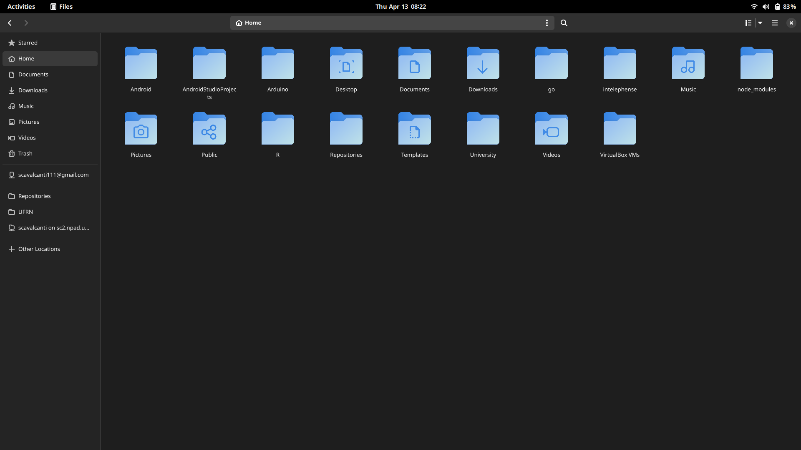
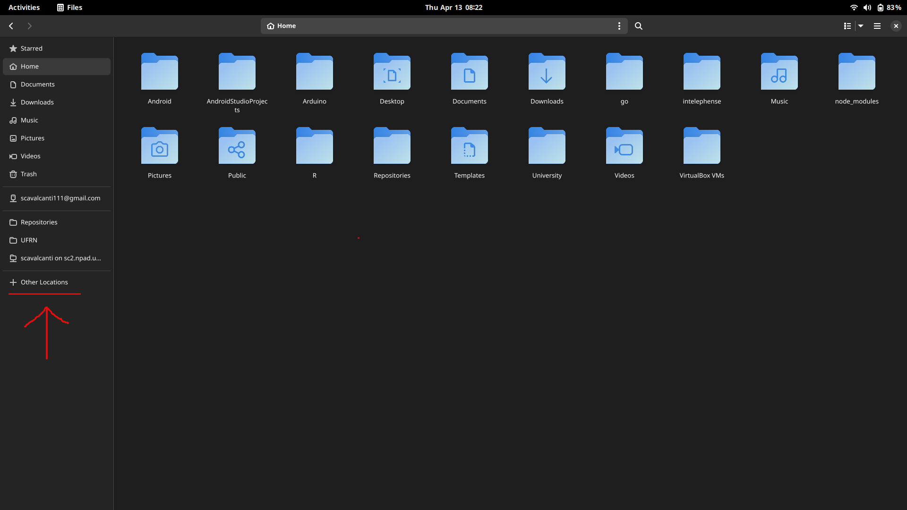
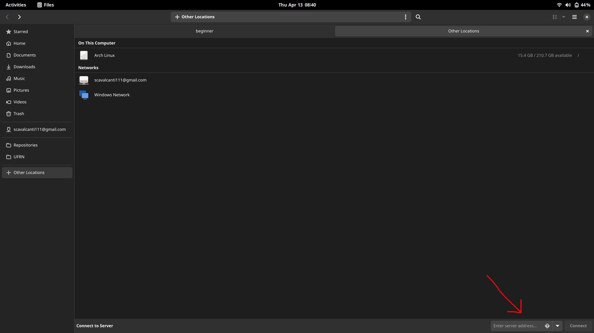
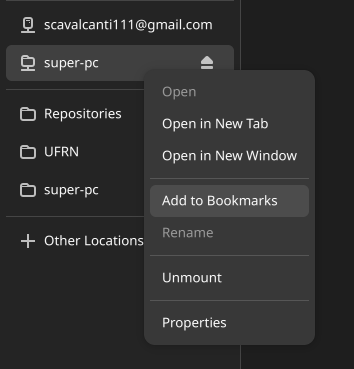

# Copiando arquivos através de uma interface gráfica Gnome Files (linux)

**Gnome** é a interface padrão do **Ubuntu**. Que é distribuição padrão
para desenvolvimento do Instituto Metrópole Digital (IMD). Portanto iremos mostrar como conectar o navegador de arquivos padrão do Gnome, chamado **Gnome files** com os seus arquivos no supercomputador. A versão do Gnome files utilizada é a **43.3**



## Clique em Other Locations

Abra o gestor de arquivos Gnome files e clique em **Other Locations** como
apontado na imagem



## Digite o endereço do super pc

No canto inferior direito, digite o endereço do supercomputador. No caso o endereço varia de acordo com o seu nome de usuário:

```bash
ssh://nomeDoUsuario@sc2.npad.ufrn.br:4422
```

No entanto caso você tenha configurado o arquivo **~/.ssh/config**
o endereço pode ser escrito da seguinte forma:

```bash
ssh://super-pc
```



### Dica: Adicione nos favoritos

Para não precisar ficar refazendo este tutorial, você pode salvar o
o endereço do supercomputador nos favoritos, clicando com botão direito do mouse e depois em **add to Bookmarks**


