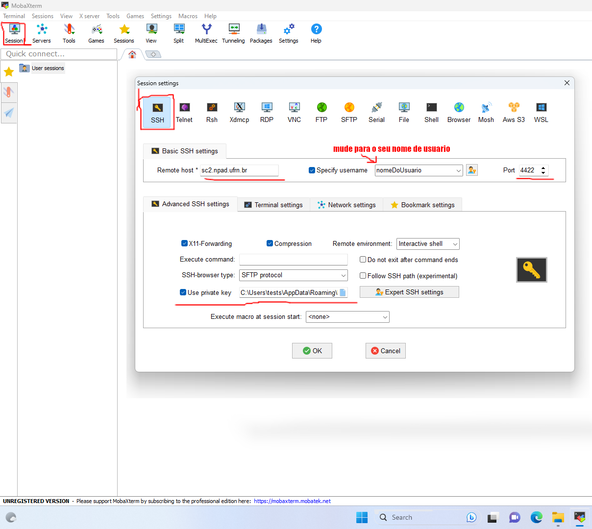

# Tutorial do MobaXterm 

A versão do MobaXterm utilizada neste tutorial é a **23.1**

## Criando uma sessão com NPAD

Para deixar salvo uma sessão com NPAD, você ir em:
**session -> ssh** e preencha o formulário da seguinte maneira:

- Remote host coloque: **sc2.npad.ufrn.br**
- Port: **4422**
- Marque a caixa **Specify username** e coloque o seu usuário

Clique em **Advanced SSH settings** e marque a caixa **Use private key**. Verifique se a chave privada está correta. Se você criou uma chave seguindo o nosso tutorial, o nome da chave é **id_rsa** e está localizada em **C:\Users\NomeDoSeuUsuário\AppData\Roaming\MobaXterm\home\\.ssh\id_rsa**.

