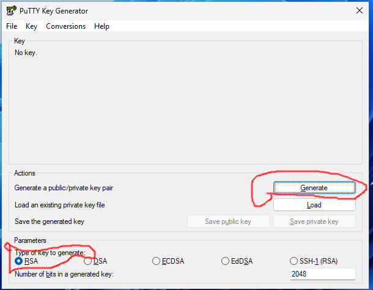
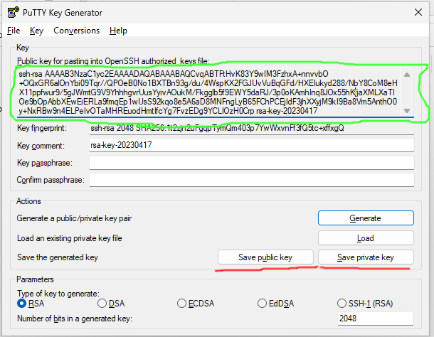
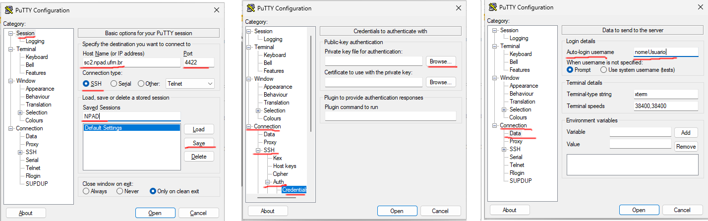

# Tutorial do PuTTy

Nesses tutoriais foi utilizado o PuTTy na sua versão **0.78**

## Gerando um par de chaves público/privada tipo RSA

Procure nos seus aplicativos e abra o programa **puttygen**.
Em **Type of Key to generate** selecione **RSA**. Clique em **Generate**.

Faça movimentos aleatórios com o mouse até preencher toda a barra verde. Quando
isso acontecer irá aparecer a seguinte tela:

Debaixo de **Public key for pasting into OpenSSH authorized keys file:** Encontra-se
a chave que você deve copiar colocar criar uma conta no NPAD. Lembre-se de salvar duas chaves, a publica e a privada. Você deve salvar as chaves clicando em **Save public-key** e **Save private-key**. Se você não colocar uma passphrase ele irá lhe alerta isso mas não é necessário colocar uma. *LEMBRE-SE* que se você colocar uma passphrase e esquece-la ou perder o par de chaves você terá que criar um novo par de chaves e [adicionar uma nova chave](http://npad.ufrn.br/npad/chave).

## Acessando o supercomputador através do PuTTy

Uma vez tendo feito o cadastro com a chave publica gerada anteriormente.
É necessário configurar o PuTTy para realizar o login no supercomputador.
Três configurações precisam ser feitas.

- Adicionar a chave privada que você criou com **PuTTYgen** em **Connection -> SSH -> Auth -> Credentials**
- Adicionar o seu nome de usuário cadastrado no NPAD em **Connection -> Data**
- Adicionar o hostname: **sc2.npad.ufrn.br** e port: **4422** em **Session**

Certifique-se que em **Session**, a caixa **SSH** em Connection type está marcada.
Abaixo de **Saved Sessions** escreva um nome dessa sessão, como por exemplo NPAD.
Clique em **Save** para salvar todas as configurações feitas até o momento.
Dessa forma sempre que quiser acessar o NPAD através do PuTTy é só selecionar o
nome da sessão, clicar em **Load** e depois no botão **Open**.

