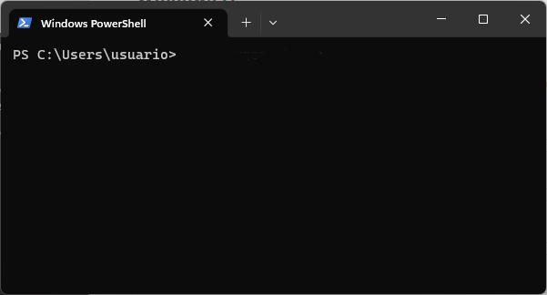

# Introdução ao supercomputador - Parte&nbsp;1

O NPAD oferece como solução um acesso a um supercomputador através de um terminal remoto. Para acessar o supercomputador é necessário utilizar um programa chamado [ssh](https://linuxcommand.org/lc3_man_pages/ssh1.html). O ssh é uma programa que permite fazer login em uma máquina remotamente. Neste tutorial iremos aprender a gerar uma chave ssh, a acessar o supercomputador e a transferir arquivos para o supercomputador. Caso tenha alguma dúvida durante o tutorial, sinta-se à vontade para entrar em contato conosco através do e-mail **atendimento\<at>npad.ufrn.br** (substituindo \<at> por @).

[TOC]

## Instale os pré-requisitos

Como dito anteriormente, acessar o supercomputador requer ssh. O ssh é apenas uma das ferramentas do [OpenSSH](https://www.openssh.com/). A seguir veremos como instalar o ssh em cada sistema operacional:

### Windows 11

O Windows 11 já tem instalado o OpenSSH e, portanto, nenhuma ação é necessária.

### Outros Windows

Você pode seguir por um desses caminhos:

- [Instalar o MobaXterm Home Edition que já vem com OpenSSH](https://mobaxterm.mobatek.net/download-home-edition.html)
- [Instalar o PuTTY que possui o seu próprio cliente ssh](https://www.chiark.greenend.org.uk/~sgtatham/putty/latest.html)
- [Instalar OpenSSH e utilizar o Windows PowerShell como terminal](https://learn.microsoft.com/pt-br/windows-server/administration/openssh/openssh_install_firstuse)


### Linux

Procure por openssh nos repositórios oficiais. No caso do ubuntu para instalar o openssh é:

```bash
sudo apt install openssh-client
```

Recomendamos utilizar o cliente ssh e terminal oficiais do sistema operacional que estiver utilizando.

## Gerando uma chave SSH pública

Para criar uma conta no supercomputador, ou tenha perdido a chave pública. Será necessário inserir uma nova chave pública do tipo **rsa**. Esta seção mostrará como gerar uma chave pública

### Windows 11

Procure pelo Windows Terminal e abra-o.



Para gerar sua chave ssh do tipo **rsa**, digite o comando a seguir que irá ser realizado uma sequência de perguntas, apenas pressione enter em todas elas:
```
ssh-keygen -t rsa
```
Para visualizar sua chave pública, digite o comando a seguir:
```bash
type .ssh\id_rsa.pub
```
Você precisará copiar e colar essa chave pública na hora de criar uma conta ou adicionar outra chave. Com uma chave pública você está pronto para criar uma conta no NPAD. Perceba que você criou uma chave privada em **.ssh\id_rsa** e uma chave pública em **.ssh\id_rsa.pub**.

###  Windows com MobaXterm

Abra o MobaXterm e clique no botão **start local terminal**

Para gerar sua chave ssh do tipo **rsa** , e digite o comando a seguir:

```bash
ssh-keygen -t rsa
```

Irá ser realizado uma sequência de perguntas, apenas pressione enter em todas elas. Para visualizar sua chave pública, digite o comando a seguir:

```bash
cat .ssh/id_rsa.pub
```

Você precisará copiar e colar essa chave pública na hora de criar uma conta ou adicionar outra chave. Com uma chave pública você está pronto para criar uma conta no NPAD. Perceba que você criou uma chave privada em **.ssh/id_rsa** e uma
chave pública **.ssh/id_rsa.pub**.

###  Windows com PuTTy

Veja esse tutorial: [PuTTy Tutoriais: Gerando um par de chaves publico privada tipo RSA](../beginner/putty_tutorial.md#gerando-um-par-de-chaves-publico-privada-tipo-rsa)

### Linux

Abra o terminal do linux ou aperte **Ctrl + Alt + T**

Para gerar sua chave ssh do tipo **rsa**, digite o comando a seguir:

```bash
ssh-keygen -t rsa
```

Irá ser realizado uma sequência de perguntas, apenas pressione enter em todas elas. Para visualizar sua chave pública, digite o comando a seguir:

```bash
cat .ssh/id_rsa.pub
```

Você precisará copiar e colar essa chave pública na hora de criar uma conta ou adicionar outra chave. Com uma chave pública você está pronto para criar uma conta no NPAD. Perceba que você criou uma chave privada em **.ssh/id_rsa** e uma
chave pública **.ssh/id_rsa.pub**.

## Criando uma conta no NPAD

Para utilizar o supercomputador é necessário criar uma conta na nossa [Página de Cadastro](http://npad.ufrn.br/primeirospassos.php). Para realizar o cadastro, verifique qual o seu enquadramento na nossa Política de Acesso para saber qual o Tipo de Usuário da sua conta. Na Página de Primeiros Passos você obterá informações sobre o primeiro acesso. Depois de fazer o cadastro no site do NPAD, você receberá um e-mail confirmando sua inscrição. Após receber o e-mail, você poderá acessar o supercomputador do computador que gerou o par de chaves ssh observando as orientações presentes neste tutorial.

## Acessando o supercomputador

Uma vez que tenha cadastro no NPAD, você pode acessar o supercomputador de
duas formas:

- Usando a aplicação **PuTTy**. Caso deseja usar o PuTTy veja o tutorial do [PuTTy](../beginner/putty_tutorial.md#acessando-o-supercomputador-atraves-do-putty).

- através de um terminal como: **Windows PowerShell**, **MobaXterm**, usando o comando **ssh**

Caso deseja usar o ssh, então dentro do terminal digite o comando:

```bash
ssh -p4422 nomeDoUsuario@sc2.npad.ufrn.br
```

substituindo o termo **nomeDoUsuario** pelo nome de usuário criado. Caso tenha feito tudo corretamente será apresentada a tela inicial do supercomputador:

```bash
╭──────────────────────────────────────── NPAD ────────────────────────────────────────╮
│  Núcleo de Processamento de Alto Desempenho - Universidade Federal do Rio Grande do  │
│                                        Norte                                         │
│                                                                                      │
│ ────────────────────────────────────── ALERTA ────────────────────────────────────── │
│                                                                                      │
│ O uso deste sistema é restrito apenas a usuários autorizados. Você deve possuir      │
│ permissões explícitas para acessar ou configurar este servidor. Todas as atividades  │
│ realizadas neste dispositivo estão sujeitas a monitoramento e gravação e poderão ser │
│ devidamente reportadas em caso de uso ilegal. Obrigado.                              │
│                                                                                      │
│ ─────────────────────────────────────── FAQ ──────────────────────────────────────── │
│                                                                                      │
│ Dúvidas? Veja nosso FAQ em http://npad.ufrn.br/faq.php                               │
│                                                                                      │
│ ─────────────────────────────────────── USO ──────────────────────────────────────── │
│                                                                                      │
│                            Uso atual dos nós do sistema                              │
│                  ┏━━━━━━━━━━━┳━━━━━━┳━━━━━━━┳━━━━━━━┳━━━━━━━━━━━━┓                   │
│                  ┃ Partição  ┃ Idle ┃ Mixed ┃ Alloc ┃ Maint/Down ┃                   │
│                  ┡━━━━━━━━━━━╇━━━━━━╇━━━━━━━╇━━━━━━━╇━━━━━━━━━━━━┩                   │
│                  │ cluster   │ 10   │ 9     │ 31    │ 1          │                   │
│                  │ service   │ 3    │ 0     │ 1     │ 0          │                   │
│                  │ test      │ 13   │ 9     │ 32    │ 1          │                   │
│                  │ intel-512 │ 0    │ 0     │ 6     │ 0          │                   │
│                  │ intel-256 │ 3    │ 3     │ 0     │ 1          │                   │
│                  │ gpu       │ 2    │ 0     │ 0     │ 0          │                   │
│                  └───────────┴──────┴───────┴───────┴────────────┘                   │
│                                                                                      │
│ ────────────────────────────────────── QUOTA ─────────────────────────────────────── │
│                                                                                      │
│                     Você utilizou 81.5 % de sua quota de disco.                      │
│ ━━━━━━━━━━━━━━━━━━━━━━━━━━━━━━━━━━━━━━━━━━━━━━━━━━━━━━━━━━━━━━━━━━━━╺━━━━━━━━━━━━━━━ │
│                                                                                      │
│ ───────────────────────────────────── NOTÍCIAS ───────────────────────────────────── │
│                                                                                      │
|                                      ...........                                     |
╰──────────────────────────────────────────────────────────────────────────────────────╯
$
```

!!! Warning "Aviso: usuários não tem permissão para usar o comando sudo"  
    Sudo significa “super user do” e é um comando para elevar seus privilégios ao poderoso usuário root que tem acesso total a todo o sistema. Por isso, você não tem permissão para usar o sudo.
    Se precisar fazer algo que necessite do poder de administrador do sistema, entre em contato com o atendimento do NPAD para obter assistência.

### Crie uma configuração para ssh

Se você criar ou adicionar a seguinte configuração no arquivo **~/.ssh/config**:

```bash
Host super-pc
  HostName sc2.npad.ufrn.br
  Port 4422
  User nomeDoUsuario
```

trocando o **nomeDoUsuario** pelo nome do seu usuário, você poderá acessar o supercomputador usando o comando:

```bash
ssh super-pc
```

Caso você esteja usando MobaXterm, você pode criar uma nova sessão para facilitar
o acesso ao supercomputador: [MobaXterm tutoriais: criando uma sessão com NPAD](../beginner/mobaxterm_tutorial.md)

## Acessando arquivos do supercomputador

O OpenSSH além de permitir fazer login em uma máquina remotamente, também
permite a transferência de arquivos por aplicações de linha de comando
quanto por software de interface gráfica de terceiros.

### Através de uma interface gráfica

Em muitos casos é simplesmente mais prático acessar, copiar e mover arquivos
do seu computador para o supercomputador através de uma interface gráfica.
Para isso você pode utilizar o **WinSCP** no caso do Windows ou configurar o
próprio navegador de arquivos do ubuntu: **Gnome Files** para essa tarefa.
Foi feito dois tutoriais:

- [Copiando Arquivos através de uma Interface gráfica WinSCP (Windows)](../beginner/winscp_tutorial.md)

- [Copiando Arquivos através de uma Interface gráfica Gnome Files (linux)](../beginner/gnome_files.md)

### Através do terminal

É possível transferir arquivos através das aplicações de linhas de comando como:
[scp](https://linux.die.net/man/1/scp) e [rsync](https://linux.die.net/man/1/rsync). Sendo o **rsync** apenas para linux e **scp** funciona também no Windows 11 pelo Windows Terminal. Nos demais Windows,  apenas se você instalar o [OpenSSH](https://learn.microsoft.com/pt-br/windows-server/administration/openssh/openssh_install_firstuse). Para aprender a usar o **scp** veja o [tutorial: scp](../beginner/scp_tutorial.md) e para o **rsync** veja o [tutorial: rsync](../beginner/rsync_tutorial.md).
