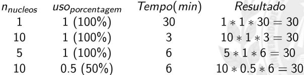

# Introdução ao supercomputador - Parte&nbsp;2

Nesse tutorial iremos aprender a criar um script e executar um programa utilizando o supercomputador. Caso surja alguma dúvida durante o tutorial, sinta-se à vontade para entrar em contato conosco através do e-mail **atendimento\<at>npad.ufrn.br** (substituindo \<at> por **@**).

[TOC]

## Criando um script para um programa já existente no supercomputador

Para criar um **script** para executar programas no supercomputador é necessário informar o nome do programa que irá ser executado e o tempo máximo de sua execução (saiba como escolher o tempo de execução [aqui](http://npad.ufrn.br/tutoriais/introducao-parte3.php#backfill)). **O tempo máximo depende do tipo de nó escolhido.** Acesse o supercomputador e siga as orientações a seguir.

**Exemplo: criação de um script para executar o programa factor.**

No terminal, entre com o comando abaixo no terminal do Linux, seguido de enter.

```bash
nano nomeScript    # Substitua nomeScript pelo nome que você deseja dar ao seu script
```

Após abrir o programa **nano**, execute os comandos abaixo no terminal do Linux:

```bash
#!/bin/bash
#SBATCH --time=0-0:5    # Especifica o tempo máximo de execução do job, dado no padrão dias-horas:minutos
factor 120     # Especifica o programa a ser executado (no caso, factor) e o parâmetro de entrada (120)
```

Em sequência aperte ctrl+o, depois enter e, então, aperte ctrl+x para sair do **nano**. Vale ressaltar que também é possível abrir o arquivo correspondente ao script e fazer alterações diretamente nele, via [interface gráfica](superpc_introduction_part_1.md#atraves-de-uma-interface-grafica).

## Executando um programa já existente no supercomputador

Para executar um programa no supercomputador, você precisará criar um script, conforme descrito anteriormente, e escolher em qual tipo de nó o programa vai ser executado:

### Execução de programas no nó de login

O nó de login é mais indicado para execução de softwares de teste, ou seja, que requerem um tempo de execução menor. O tempo limite para execução neste nó é de 30 minutos, considerando que o usuário está utilizando apenas um núcleo e 100% de sua capacidade. Um usuário que decide utilizar esse nó para execução de um processo que ocupa 100% de 10 CPUs, por exemplo, será terminado automaticamente após 3 minutos de uso, como pode ser visto na tabela abaixo (**Figura 1**), junto com demais exemplos. Isso ocorre mesmo que o script tenha tempo maior configurado. Desse modo, recomenda-se utilizar o nó de login apenas para fins de teste.



**Figura 1 - Tabela com exemplos de tempo de execução de programas no nó de login, para várias configurações**

Para executar um programa no supercomputador no nó de login, use o comando a seguir no terminal do Linux:

```bash
./meuPrimeiroScript
```

Onde **meuPrimeiroScript** é o script com os dados de execução.

### Execução de programas no nó de computação

O Nó de Computação, por sua vez, é o mais indicado para uso de softwares gerais, que necessitem de um tempo de execução elevado. É nele que você irá utilizar a maioria dos programas disponíveis no supercomputador, podendo deixá-los em execução por longos períodos. A seguir, você irá aprender como criar scripts e executar programas no nó de computação.

Para executar um programa no supercomputador no nó de computação, use o comando a seguir no terminal do Linux:

```bash
sbatch meuPrimeiroScript
```

Onde **meuPrimeiroScript** é o script com os dados de execução.

### Verificação da execução

Caso o job tenha sido submetido corretamente, aparecerá a mensagem:

`Submitted batch job JobID`

Onde JobID será substituído pelo número que identificará o job. A saída do programa não aparecerá na tela. Ela será escrita em um arquivo de nome **slurm-JobID.out**, onde JobID será o mesmo valor do id do job submetido.

Para ver a saída do programa, use o comando:

```bash
cat slurm-JobID.out
```

Substituindo JobID pelo id do job que você deseja ver a saída.

```bash
[nomeDoUsuario@service0 ~]$ sbatch meuPrimeiroScript
Submitted batch job 14518
[nomeDoUsuario@service0 ~]$ cat slurm-14518.out
120: 2 2 2 3 5
```

A execução de um programa no supercomputador está sujeita à disponibilidade de nós, desse modo, o resultado pode demorar. Para acompanhar o andamento da fila, bem como a prioridade do job submetido por você na mesma, a seção de [Comandos](../intermediate/slurm_commands.md) pode ser bastante útil.

## Criando um script para executar um programa criado a partir do código-fonte

**Caso o programa tenha sido criado a partir do códido-fonte deve-se acrescentar ao nome do programa a pasta onde este se encontra.**

**Exemplo:**

```bash
#!/bin/bash

#SBATCH --time=0-0:5 #especifica o tempo máximo de execução do job, dado no padrão dias-horas:minutos

./helloWorld #o ponto e a barra indicam o caminho até a pasta atual.
```

Saiba como escolher o tempo de execução [aqui](../intermediate/superpc_introduction_part_3.md#backfill-e-escolha-do-tempo-de-execução).

## Executando um programa criado a partir do código-fonte

Para executar um programa a partir do código-fonte o usuário deverá, em sua pasta no supercomputador, gerar o programa executável.

Para criar o executável do programa digite:

```bash
gcc helloWorld.c -o helloWorld
```

Onde **helloWorld.c** é o código-fonte e **helloWorld** é o código executável.

Para executar o programa gerado, você deverá executar o script gerado anteriormente utilizando o comando `sbatch jobHelloWorld` ou `sbatch -p test jobHelloWorld` de acordo com o tipo de nó desejado.

Caso o job tenha sido submetido corretamente, aparecerá a mensagem:

`Submitted batch job JobID`

Onde JobID será substituído pelo número que identificará o job. A saída do programa não aparecerá na tela. Ela será escrita em um arquivo de nome **slurm-JobID.out**, onde JobID será o mesmo valor do id do job submetido.

Para ver a saída do programa, use o comando:

```bash
cat slurm-JobID.out
```

Substituindo JobID pelo id do job que você deseja ver a saída.

```bash
[nomeDoUsuario@service0 ~]$ gcc helloWorld.c -o helloWorld
[nomeDoUsuario@service0 ~]$ sbatch jobHelloWorld
Submitted batch job 14520
[nomeDoUsuario@service0 ~]$ cat slurm-14520.out
Hello World!
```

Para executar programas em paralelo no supercomputador, leia os tutorias de [OpenMP](../advanced/openmp_tutorial.md) e [MPI](../advanced/mpi_tutorial.md).
